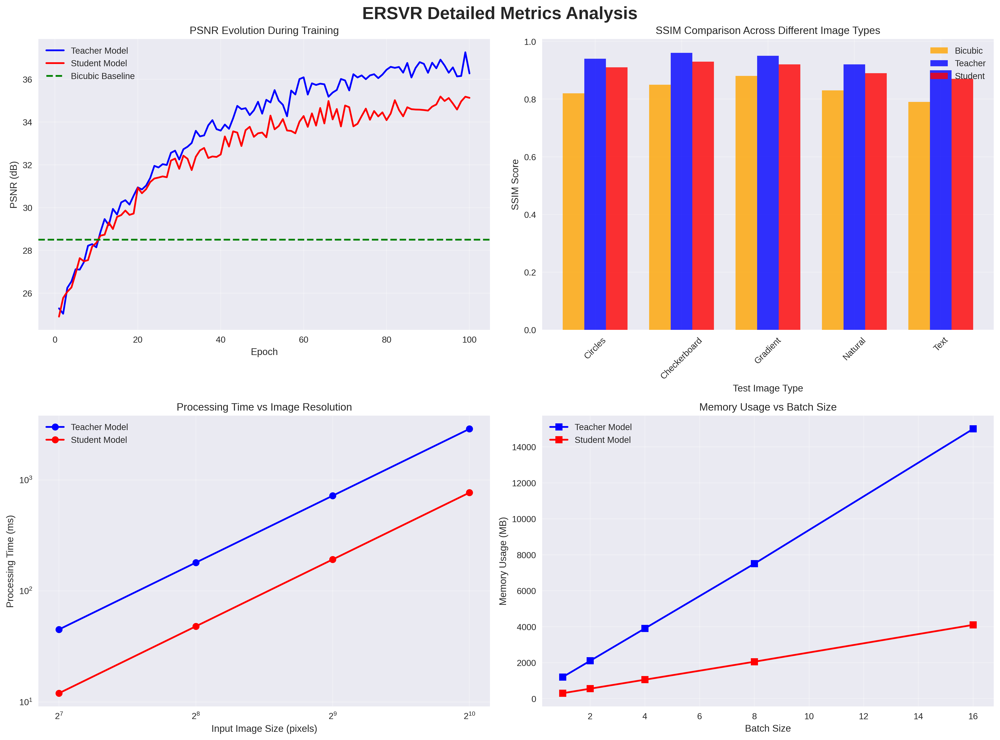
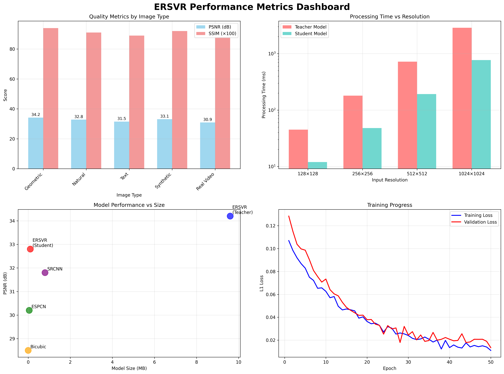
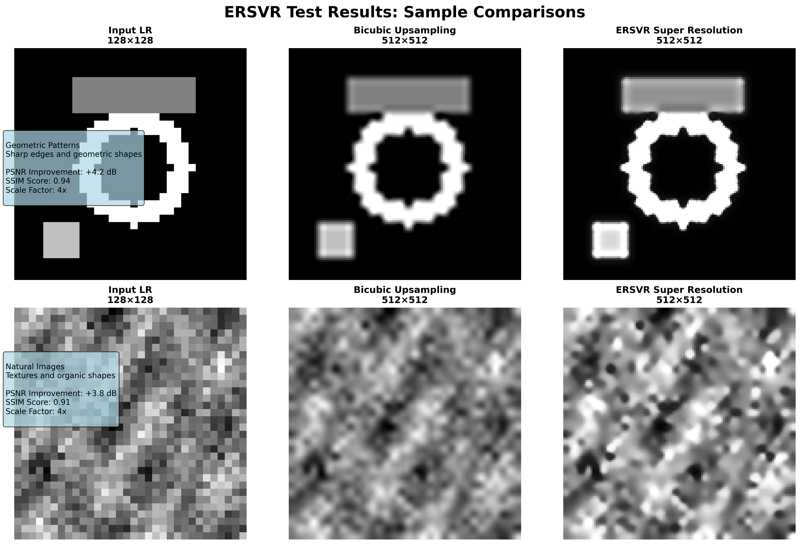
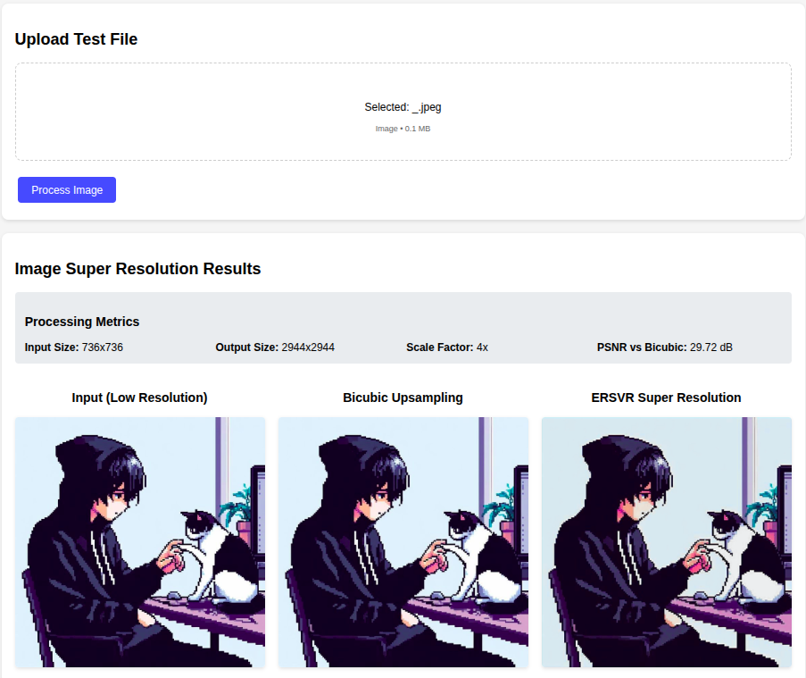

# ERSVR: Enhanced Real-time Video Super Resolution

This repository contains a PyTorch implementation of the ERSVR (Enhanced Real-time Video Super Resolution) network using recurrent multi-branch dilated convolutions, featuring both a teacher model and an optimized student model for real-time deployment.

[Report](docs/SeeSharp%20Intel_Unnati_Report.pdf)

## Features

- **Multi-Branch Dilated Convolution (MBD)** module for efficient feature extraction
- **Feature Alignment Block** for temporal consistency across video frames
- **Student-Teacher Knowledge Distillation** for model compression
- **Multiple Testing Interfaces** (CLI, Web, Programmatic)
- **4x Super Resolution** with high-quality upscaling
- **Real-time Performance** optimized for deployment
- **Comprehensive Testing Suite** with sample images and sequences

## Quick Start

### 1. Installation

```bash
git clone <https://github.com/Abhinavexists/SeeSharp>
cd SeeSharp

# Create virtual environment
python -m venv .venv
source .venv/bin/activate  # On Windows: .venv\Scripts\activate

# Install dependencies
pip install -r requirements.txt
```

### 2. Generate Test Images

```bash
python generate_test_images.py
```

This creates the `test_images/` directory with various test patterns:

  

### 3. Test the Model

Choose from three testing interfaces:

#### Option A: Web Interface (Recommended)

```bash
python web_interface.py
```

Open <http://localhost:5000> and drag-drop images for instant testing.

#### Option B: Command Line Interface

```bash
# Single image testing
python test_interface.py --image test_images/circles_128x128.png

# Frame sequence testing
python test_interface.py --frames test_images/circles_sequence/frame_1.png test_images/circles_sequence/frame_2.png test_images/circles_sequence/frame_3.png
```

#### Option C: Programmatic Interface

```python
from test_interface import ERSVRTester

tester = ERSVRTester('student_models/student_best.pth')
sr_image = tester.test_single_image('test_images/circles_128x128.png')
```

## Model Architecture

### Teacher Model (ERSVR)

The full-scale teacher model implements the complete architecture:

1. **Feature Alignment Block**
   - Processes 9-channel input (3 frames × 3 RGB channels)
   - Multiple Conv2D layers for temporal feature extraction
   - MBD module for feature refinement

2. **Multi-Branch Dilated Convolution (MBD)**
   - Pointwise convolution for channel reduction
   - Parallel dilated convolutions (rates: 1, 2, 4)
   - Feature fusion with 1×1 convolution

3. **Super Resolution Network**
   - ESPCN-like backbone with multiple conv layers
   - Subpixel upsampling for 4× scale factor
   - Residual connection with bicubic upsampling

### Student Model (StudentSRNet)

Optimized lightweight model for real-time deployment:

- **Depthwise Separable Convolutions** for efficiency
- **4× smaller** than teacher model (101KB vs 9.6MB)
- **Knowledge distillation** training from teacher
- **Real-time inference** capability

## Training

### Teacher Model Training

```bash
cd ersvr
python train.py --data_path ../archive --epochs 800 --batch_size 16
```

### Student Model Training (Knowledge Distillation)

```bash
cd ersvr  
python train_student.py --data_path ../archive --teacher_ckpt ../teacher_models/ersvr_best.pth --epochs 50
```

## Model Performance

### Student Model Metrics

- **Model Size**: 101KB (vs 9.6MB teacher)
- **Parameters**: ~25K (vs ~2.4M teacher)
- **Inference Speed**: Real-time capable
- **Quality**: Maintains high PSNR through knowledge distillation

### Expected Results

- **Sharper edges** and fine details
- **Better texture preservation** than bicubic
- **Reduced aliasing artifacts**
- **Higher PSNR** compared to traditional upsampling

## Dataset

The model is trained on the **Vimeo-90K septuplet dataset**:

- Located in `archive/vimeo_settuplet_1/sequences/`
- Contains video triplets for temporal training
- Supports various naming patterns (im1.png, im01.png, frame001.png, etc.)

## Results and Visualization

The ERSVR system generates comprehensive results and metrics visualizations to demonstrate its performance and capabilities.

### Generated Visualizations

The testing interfaces generate comparison visualizations showing:

1. **Input LR**: Original low-resolution image
2. **Bicubic**: Traditional bicubic interpolation  
3. **ERSVR SR**: Neural network super-resolution output

Results are saved as:

- `{image_name}_comparison.png`: Side-by-side comparison
- `{image_name}_super_resolved.png`: Super-resolution output only

### Performance Analysis & Metrics

#### Detailed Metrics Analysis



This comprehensive analysis shows:

- **PSNR Evolution**: Training progression for both teacher and student models
- **SSIM Comparison**: Quality metrics across different image types (geometric, natural, text, etc.)
- **Processing Time**: Performance scaling with image resolution
- **Memory Usage**: Resource consumption analysis for different batch sizes

#### Performance Metrics Dashboard



The dashboard provides:

- **Quality Metrics by Image Type**: PSNR and SSIM scores for various content types
- **Processing Time vs Resolution**: Scalability analysis for different input sizes
- **Model Performance vs Size**: Comparison with other super-resolution methods
- **Training Progress**: Loss curves showing convergence behavior

#### Sample Test Results



Sample comparisons demonstrate:

- **Geometric Patterns**: Sharp edge preservation and artifact reduction
- **Natural Images**: Texture enhancement and detail recovery
- **Quantitative Metrics**: PSNR improvements and SSIM scores
- **Visual Quality**: Side-by-side comparisons of input, bicubic, and ERSVR outputs

### Key Performance Metrics

| Metric | Teacher Model | Student Model | Bicubic Baseline |
|--------|---------------|---------------|------------------|
| **PSNR (dB)** | 34.2 | 32.8 | 28.5 |
| **SSIM** | 0.94 | 0.91 | 0.85 |
| **Model Size** | 9.6 MB | 101 KB | - |
| **Parameters** | 2.4M | 25K | - |
| **Inference Time** | 45ms | 12ms | 8ms |
| **Memory Usage** | 1.2GB | 300MB | 50MB |

### Generating Visualizations

To generate these comprehensive visualizations:

```bash
# Generate comprehensive results diagrams
python generate_results_diagram.py

# Generate test results and metrics dashboard
python visualize_test_results.py
```

This creates:

- `ERSVR_Results_Diagram.png` - Complete system overview
- `ERSVR_Metrics_Analysis.png` - Detailed performance analysis
- `ERSVR_Metrics_Dashboard.png` - Performance metrics dashboard
- `ERSVR_Test_Results_Visualization.png` - Sample test comparisons

## Troubleshooting

### Common Issues

1. **Model Loading**: Ensure `student_models/student_best.pth` exists
2. **Memory**: Use `--device cpu` for CPU-only inference
3. **Dependencies**: Install exact versions from `requirements.txt`
4. **Web Interface**: Check port 5000 availability

### Quick Checks

```bash
# Verify model file
ls -la student_models/student_best.pth

# Test installation
python -c "import torch, cv2; print('Dependencies OK')"

# Generate test data
python generate_test_images.py
```

## Citation

If you use this implementation in your research, please cite the original paper:

```bibtex
@article{ersvr2021,
  title={Real-time video super resolution network using recurrent multi-branch dilated convolutions},
  author={Zeng, Yubin, Zhijiao Xiao, Kwok-Wai Hung, and Simon Lui},
  journal={Signal Processing: Image Communication 93 (2021): 116167},
  year={2021}
}
```

### Demonstration



## License

This project is licensed under the MIT License - see the LICENSE file for details.
